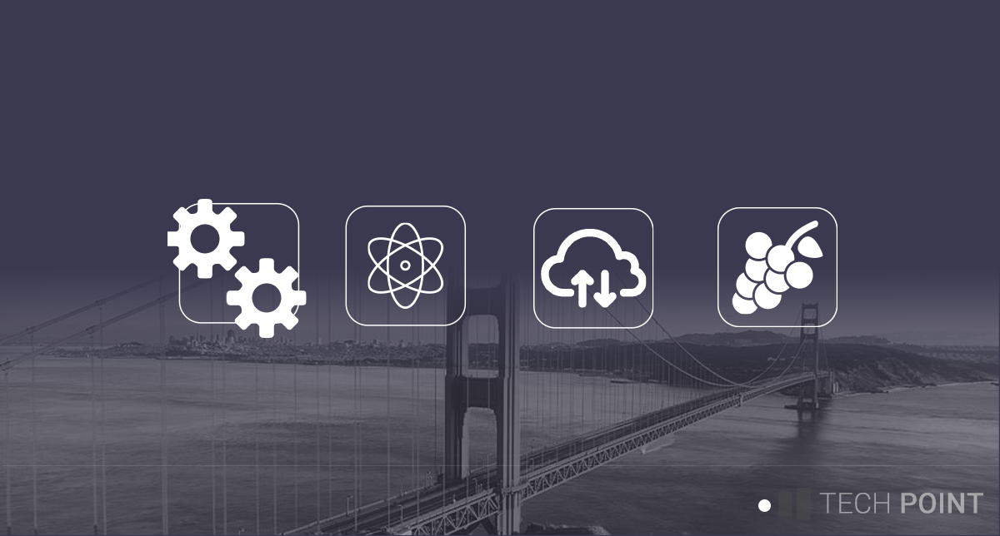

<h1 align="center">
Hello! My name is Matthew
</h1>

	
Once upon a time I decided to start programming around the age of 10 years old.

	
	

	I had an early interest in multimedia that lead me into doing some pretty engaging projects such as the following.
	

	
	[todo insert images]
	
	

			Through a strange turn of events, I ended up shifting focus over to software engineering, and somehow ended leading a team responsible for creating the worlds most complex Inventory Tracking System for a space in the beverage manufacturing industry. The specs I has handed for designing core looked a little something like this, with flowcharts ranging from 30 to in upwards of a 100 pages. Needless to say, there was a lot of coffee and beer involved in the process.
	

	
		[todo insert images]
		
	

		As a father of three children, it is hard to find spare time to contribute back to the community, but I am constantly experiementiung and hacking when I find the chance, so I am finally starting to formalize and share the results of my efforts.
	

	
	

		I tend to focus on React, NodeJS, and Java/Spring stacks, with a strong emphasis on user experience, I prefer a full stack approach towards projects.
	

	
	

		When I am not behind the keyboard, you can usually find me cooking, pursuing my interests in art, or hanging out with my children.
	

	
	

		
	

	
	

